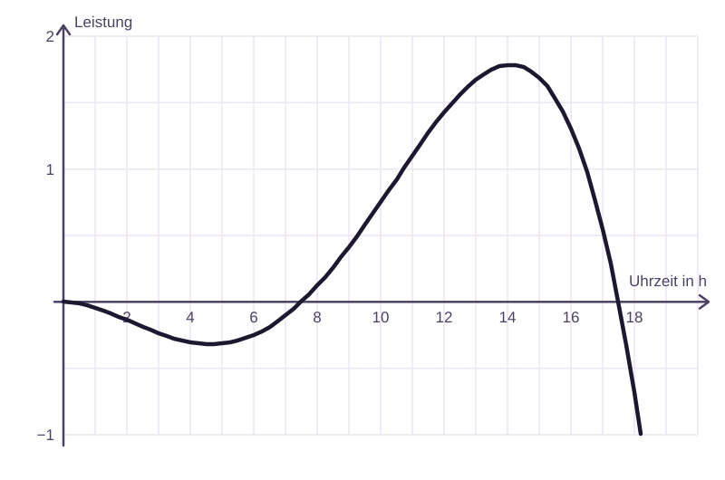

# Stunde 1

## Impuls: Wann erzeugt die Solarzelle Strom?

::bis{4:00}

::spalte
Eine kleine Solarzelle wird im Tagesverlauf durch $f(x)$ modelliert.

$ f(x) = -1/2500 x^4 + 1/100 x^3 - 21/400 x^2 $

Von wann bis wann wird Strom erzeugt?

::notiz

- Bild kurz wirken lassen, erste Ideen sammeln
- falls nötig klären: Strom wird erzeugt, wenn $f(x) > 0$
- Frage offenlassen, noch nicht lösen

## Wiederholung: Achsenschnittpunkte

::bis{7:00}

### Schnittpunkt mit der y-Achse

- $x = 0$ einsetzen
- $f(0) = a_0$
- genau ein Punkt

### Schnittpunkt mit der x-Achse

- $f(x) = 0$ setzen
- Lösungen heißen **Nullstellen**
- es kann mehrere geben

::notiz

- Wiederholung aktivieren
- Übergang: Für die Solarzelle brauchen wir die Nullstellen

## Beispiel: Achsenschnittpunkte bestimmen

::bis{12:00}
Bestimme beide Achsenschnittpunkte von

$ f(x) = x^2 - x - 6 $

### y-Achse

### x-Achse

::notiz

- erst y-Achse, dann Nullstellen
- $f(0) = -6$ → $(0 | -6)$
- $x^2 - x - 6 = 0$ → $x_1 = 3$, $x_2 = -2$ → $(3 | 0)$, $(-2 | 0)$

## Überblick: Welches Verfahren passt?

::bis{14:00}
Für Nullstellen schauen wir zuerst: ==In welcher Form liegt der Term vor?==

- lineare Gleichung → nach $x$ umformen
- kein konstanter Term → $x$ ausklammern
- quadratische Gleichung → pq-Formel
- nur eine Potenz von $x$ → Potenz isolieren

::notiz

- sehr knapp halten, nur als Orientierung
- bei Bedarf später nochmal aufrufen

## Verfahren: Ausklammern

::bis{19:00}
Wenn kein konstanter Term vorhanden ist, kann man oft $x$ ausklammern.

$ x^3 + 4x^2 + 3x = 0 $

Wie kann man den Term vereinfachen?

::notiz

- nicht alles vorbereitet zeigen, gemeinsam entwickeln
- $x(x^2 + 4x + 3) = 0$, also $x = 0$ oder $x^2 + 4x + 3 = 0$
- Fokus: Struktur erkennen

## Übung: Jetzt ihr: Ausklammern anwenden

::bis{25:00}
Bestimme alle Nullstellen durch Ausklammern.

$ f(x) = x^3 - 4x $

::notiz

- erst selbst versuchen lassen, dann besprechen
- $x(x^2 - 4) = 0$ → $x_1 = 0$, $x^2 = 4$ → $x = ±2$
- Nullstellen: $-2$, $0$, $2$

## Merksatz: Erst erkennen, dann rechnen

::bis{26:00}
::merkkarte{#form-entscheidet}

## Quiz: Welches Verfahren nimmst du?

::bis{30:00}

### Auswahl

$ x^3 - 9x = 0 $

- (x) Ausklammern
- ( ) pq-Formel
- ( ) Potenz isolieren

### Auswahl

$ x^4 - 16 = 0 $

- ( ) Ausklammern
- ( ) pq-Formel
- (x) Potenz isolieren

::notiz

- Frage 2 prüft, ob „Potenz isolieren“ erkannt wird
- viele A: kurz zurück zum Überblick (Frame 4)

## Anwendung: Zurück zur Solarzelle

::bis{37:00}

$ f(x) = -1/2500 x^4 + 1/100 x^3 - 21/400 x^2 $

Von wann bis wann wird Strom erzeugt?

::notiz

- jetzt algebraisch lösen, gemeinsam ausklammern
- $x_1 = 0$, quadratischer Restterm, weitere Nullstellen bei $x = 7.5$ und $x = 17.5$
- Antwort im Sachkontext: von **7:30 bis 17:30 Uhr**

## Validierung: Graph prüfen

::bis{40:00}

::spalte
Was zeigt uns der Graph?

- Wo liegen die Nullstellen?
- In welchem Bereich ist $f(x) > 0$?

::notiz

- Graph zur Validierung, kein Ersatz der Rechnung
- gemeinsam ablesen: Nullstellen bei $0$, $7.5$ und $17.5$; positiv zwischen $7.5$ und $17.5$
- also Strom von 7:30 bis 17:30

## Zusammenfassung: Zusammenfassung

::bis{43:00}

### Nullstellen bestimmen

1. $f(x) = 0$ setzen
2. passende Form erkennen
3. geeignetes Verfahren wählen

### Typische Verfahren

- lineare Gleichung
- ausklammern
- pq-Formel
- Potenz isolieren

::notiz

- Schüler sollen die Logik in eigenen Worten wiedergeben können

## Arbeitsphase: Übungsphase

::bis{45:00}
::blatt{nullstellen-ermitteln}

::notiz

- Arbeitsphase
- später ausgewählte Aufgaben vergleichen
